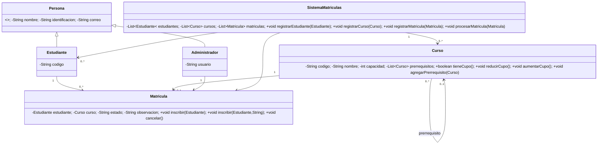

# Semana 5 — Práctica de campo y Diagrama de Clases UML

## Proceso observado
El proceso analizado es la matrícula académica: registro del estudiante, disponibilidad del curso, validación de cupo, comprobación de duplicados, creación de matrícula y cancelación.

## Elementos identificados
Estudiante, Administrador, Persona, Curso, Matrícula y SistemaMatriculas.

## Tabla de clases
| Clase | Atributos | Métodos |
|---|---|---|
| Persona | nombre, identificacion, correo | getters, setCorreo |
| Estudiante | codigo | getCodigo, toString |
| Administrador | usuario | getUsuario |
| Curso | codigo, nombre, capacidad, prerrequisitos | tieneCupo, reducirCupo, aumentarCupo, agregarPrerrequisito |
| Matricula | estudiante, curso, estado, observacion | inscribir(), inscribir(estudiante, observacion), cancelar |
| SistemaMatriculas | estudiantes, cursos, matriculas | registrarEstudiante, registrarCurso, registrarMatricula, procesarMatricula |

## Relaciones y multiplicidades
| Relación | Multiplicidad |
|---|---|
| Persona → Estudiante | Herencia |
| Persona → Administrador | Herencia |
| Estudiante — Matrícula | 1 — 0..* |
| Curso — Matrícula | 1 — 0..* |
| Administrador — Matrícula | 1 — 0..* |
| SistemaMatriculas — Estudiante | 1 — 0..* |
| SistemaMatriculas — Curso | 1 — 0..* |
| SistemaMatriculas — Matrícula | 1 — 0..* |
| Curso — Curso (prerrequisito) | 0..1 — 0..* |

## Justificación
Un estudiante puede tener cero o muchas matrículas. Cada matrícula corresponde a un estudiante y un curso. Un curso puede tener cero o muchas matrículas. Un administrador puede gestionar múltiples matrículas. El sistema administra las colecciones de estudiantes, cursos y matrículas. La relación reflexiva Curso–Curso representa los prerrequisitos.

## Diagrama UML

## Flujo
1. Administrador registra estudiante.
2. Administrador registra curso y capacidad.
3. Estudiante solicita matrícula.
4. Sistema verifica estudiante y curso.
5. Se verifica cupo.
6. Se comprueba duplicado.
7. Se crea matrícula.
8. Se reduce cupo.
9. Al cancelar, cambia el estado y se recupera el cupo.

## Evidencias
- Análisis del proceso sin datos personales reales.
- Listado de elementos.
- Tabla de clases.
- Diagrama UML.
- Captura de NetBeans.
- Captura de Git/GitHub del commit.
- Explicación de relaciones y multiplicidades.

## Adaptación individual
La autoría se concentra en una sola cuenta. Se evidencia mediante ramas, commits y Pull Requests reales; no se crean identidades ficticias para simular integrantes.